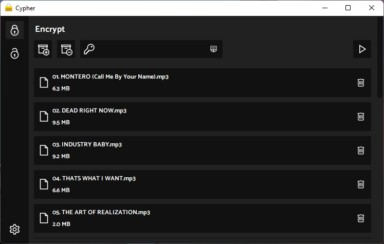
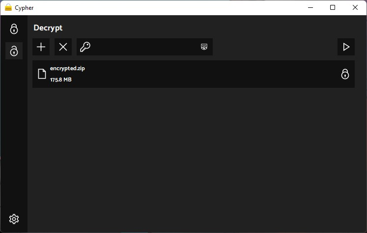

# Cypher

## Encrypt your important files

## Used Libraries

- tkinter
- os
- PIL
- threading
- cryptography
- base64
- zipfile
- typing
- darkdetect

#

### Cypher icons

Icons: [icons8](https://icons8.com/)
